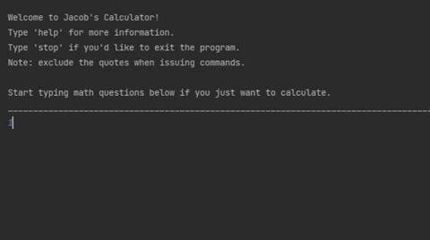

# A Simple Calculator

This is a simple calculator. Just type a math question and the calculator with return an answer.
I (Jacob McCormack) am the sole author of the program.
I made this at a beginner level of python in my first semester of college for my integration project in my COP 1500 class.(FGCU)

## Demonstration

## Getting Started

Download all the files into one folder and run main.py. You need at least python version 3.9 to run.

## Built with

* Pycharm
* Sources listed in docs.

## Contributing

* More or less built by me.

## Author

* Jacob McCormack.

## License

MIT License

## Acknowledgments

* https://www.w3schools.com/python/python_classes.asp
* https://www.w3schools.com/python/python_datatypes.asp
* https://www.youtube.com/watch?v=Wz85Hiwi5MY
* https://www.youtube.com/watch?v=bebqXO8H4eA

## Key Programming Concepts Utilized

Data structures such as stacks and queues, proper documentations strategies, input and output, operators, iteration, conditional statements, classes, instancing, and software robustness.